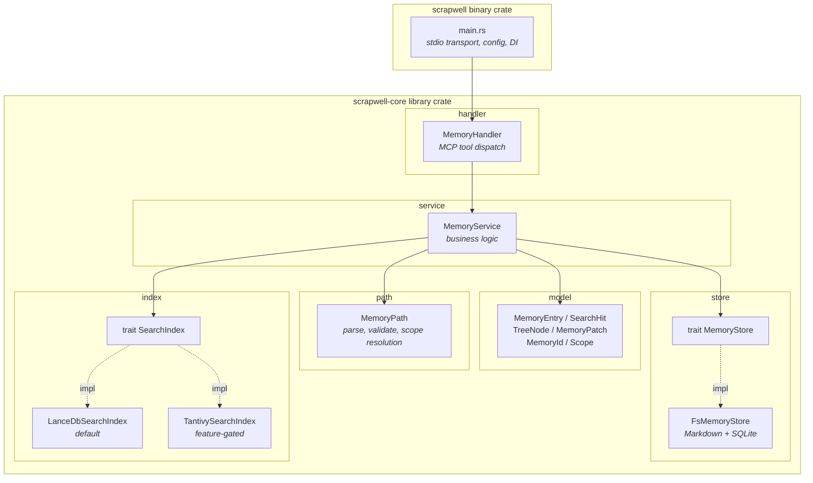

# 内部アーキテクチャ

## レイヤー構成

```
┌─────────────────────────────┐
│  Transport (main.rs)        │  MCP stdio、DI
├─────────────────────────────┤
│  Application (handler.rs)   │  MCPツールディスパッチのみ
├─────────────────────────────┤
│  Service (service/)         │  ビジネスロジック
├─────────────────────────────┤
│  Domain (model, path)       │  データ構造、バリデーション
├─────────────────────────────┤
│  Infrastructure             │  trait MemoryStore → FsMemoryStore
│                             │  trait SearchIndex → LanceDbSearchIndex
└─────────────────────────────┘
```

- **handler** はパラメータの受け取りとサービスへの委譲のみ。ロジックを書かない
- **service** はビジネスロジックの箱。Store/Indexの協調、整合性の担保を行う。MCPの概念を持ち込まない
- handler → service は具体型への依存（差し替え不要のため）
- service → infrastructure は trait への依存

## Cargo workspace構成

```
scrapwell/
  Cargo.toml                  # workspace root
  crates/
    scrapwell-core/              # library crate
      src/
        lib.rs
        model.rs              # MemoryEntry, SearchHit, TreeNode, etc.
        path.rs               # MemoryPath parsing, validation
        service/
          mod.rs              # MemoryService
        store/
          mod.rs              # trait MemoryStore
          fs.rs               # FsMemoryStore (Markdown on disk + SQLite)
        index/
          mod.rs              # trait SearchIndex
          lancedb.rs          # LanceDbSearchIndex (default)
          tantivy.rs          # TantivySearchIndex (feature-gated)
        handler.rs            # MemoryHandler (MCP tool dispatch)
    scrapwell/                   # binary crate
      src/
        main.rs               # MCP stdio transport, config, DI
```

## crate構成図



## trait定義

### MemoryStore

```rust
pub trait MemoryStore: Send + Sync {
    fn save_entity(&self, entity: &EntityMeta) -> Result<()>;
    fn get_entity_by_name(&self, name: &str) -> Result<Option<EntityMeta>>;
    fn save(&self, entry: &MemoryEntry) -> Result<()>;
    fn get(&self, id: &MemoryId) -> Result<Option<MemoryEntry>>;
    fn list_tree(&self, entity: Option<&str>, depth: u32) -> Result<TreeNode>;
    fn check_name_unique(&self, name: &str) -> Result<bool>;
    // Phase 2 以降で追加予定
    // fn update_entity(&self, id: &MemoryId, patch: &EntityPatch) -> Result<()>;
    // fn delete_entity(&self, id: &MemoryId) -> Result<()>;
    // fn update(&self, id: &MemoryId, patch: &MemoryPatch) -> Result<()>;
    // fn delete(&self, id: &MemoryId) -> Result<()>;
    // fn iter_all(&self) -> Result<Box<dyn Iterator<Item = Result<MemoryEntry>>>>;
}
```

### SearchIndex

```rust
pub trait SearchIndex: Send + Sync {
    fn upsert(&self, entry: &MemoryEntry) -> Result<()>;
    fn search(&self, query: &SearchQuery) -> Result<Vec<SearchHit>>;
    fn remove(&self, id: &MemoryId) -> Result<()>;
    fn rebuild(&self, entries: &mut dyn Iterator<Item = MemoryEntry>) -> Result<()>;
}
```

## 依存の方向

```
main.rs (DI: 全具体型を組み立て)
  └→ ScrapwellHandler<S, I> (Application層)
       └→ MemoryService<S, I> (Service層)
            ├→ S: MemoryStore  ←── FsMemoryStore
            │                        ├── entities/ (Markdown読み書き)
            │                        └── metadata.db (SQLite)
            ├→ I: SearchIndex  ←── NoopSearchIndex (Phase 1)
            │                  ←── TantivySearchIndex (Phase 3)
            ├→ model
            └→ path
```

- handler は service の具体型に依存しない。ジェネリクス `<S, I>` でtraitのみ参照
- service は infrastructure のtraitのみに依存。具体実装を知らない
- 具体型の組み立ては `main.rs` のみが行う
- `FsMemoryStore` は `Clone` を実装しないため `ScrapwellHandler` の `Clone` は手動実装

## メタデータ管理（SQLite）

`FsMemoryStore` は `~/.memory/metadata.db` を内部で保持し、メタデータの高速ルックアップに使用する。

### スキーマ

```sql
CREATE TABLE entities (
    id TEXT PRIMARY KEY,
    name TEXT UNIQUE NOT NULL,
    scope TEXT NOT NULL CHECK(scope IN ('knowledge', 'project')),
    description TEXT,
    tags TEXT,  -- JSON array
    created_at TEXT NOT NULL,
    updated_at TEXT NOT NULL
);

CREATE TABLE documents (
    id TEXT PRIMARY KEY,
    name TEXT UNIQUE NOT NULL,
    entity_id TEXT NOT NULL REFERENCES entities(id) ON DELETE CASCADE,
    topic TEXT,
    title TEXT NOT NULL,
    tags TEXT,  -- JSON array
    created_at TEXT NOT NULL,
    updated_at TEXT NOT NULL
);

CREATE INDEX idx_documents_entity_id ON documents(entity_id);
CREATE INDEX idx_documents_name ON documents(name);
CREATE INDEX idx_entities_name ON entities(name);
```

### 用途

- ID → パス逆引き（`id` で検索し `entity`/`topic`/`name` からパスを組み立て）
- ファイル名一意性チェック（`documents.name` の UNIQUE制約）
- Entity名の一意性・類似名チェック（`entities.name`）
- Entity削除時のカスケード削除（`ON DELETE CASCADE`）
- Entity内ドキュメント一覧（`entity_id` で絞り込み）

### source of truthとの関係

- **Markdownファイルがsource of truth** であることは変わらない
- SQLiteは派生データ。壊れたら `entities/` を走査して再構築可能
- ドキュメントの保存・更新・削除時に、Markdown書き込みとSQLite更新をトランザクションで同期する

## データフロー

| 操作 | MemoryStore (Markdown) | MemoryStore (SQLite) | SearchIndex |
|---|---|---|---|
| save | write .md | INSERT (uniqueness check) | upsert |
| update | update .md | UPDATE | upsert |
| delete | remove .md | DELETE | remove |
| search | — | — | query → snippets |
| list | — | SELECT by entity | — |
| get | read .md | SELECT by id (パス解決) | — |

## 並行アクセス

MCPサーバーはClaude Codeのセッションごとに1プロセスとして起動される。複数セッションが同時に動く場合の並行アクセスはSQLiteのWALモードに委ねる。

- **読み取り**: 複数プロセスから並行に実行可能
- **書き込み**: SQLiteが自動でロック。競合時は短時間リトライで成功する
- **Markdownファイル**: 異なるドキュメントを操作するため、同一ファイルへの同時書き込みは実質発生しない

特別な排他制御は実装しない。

## Wikilinkの解決

本文中の `[[wikilink]]` はObsidian互換の記法。MCPサーバーはwikilinkのパースは行うが、リンク先の存在チェックは行わない（Obsidianに委ねる）。

## 再構築フロー

Markdownがsource of truthであるため、SQLiteやSearchIndexが破損した場合は `entities/` を走査して再構築できる。

### 手順

1. `entities/` 以下の `_entity.md` を走査し、entitiesテーブルを再構築
2. `entities/` 以下の全ドキュメント `.md`（`_entity.md` 以外）を走査し、documentsテーブルを再構築
3. 全ドキュメントをSearchIndexに再投入（`rebuild()`）

### 提供方法

- **MCPツール**: `rebuild_index` — Claude Codeから実行可能。`target` パラメータで `metadata`/`search`/`all` を選択
- **CLIサブコマンド**: `scrapwell rebuild` — ターミナルから直接実行

いずれも同じ内部ロジック（`MemoryService::rebuild`）を呼び出す。

## feature gates

```toml
[features]
default = ["lancedb-backend"]
lancedb-backend = ["dep:lancedb"]
tantivy-backend = ["dep:tantivy"]
```

## エラー型

```rust
#[derive(thiserror::Error, Debug)]
pub enum ScrapwellError {
    #[error("invalid path: {0}")]
    InvalidPath(String),
    #[error("entry not found: {0}")]
    NotFound(MemoryId),
    #[error("duplicate name: {0}")]
    DuplicateName(String),
    #[error("io error: {0}")]
    Io(#[from] std::io::Error),
    #[error("index error: {0}")]
    Index(String),
}
```
